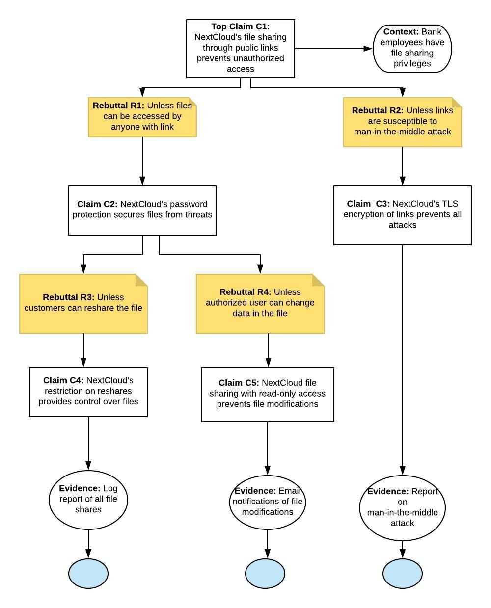

## Assurance Case 1
.png)

### Evidence 1: PGP Key Submissions
The following PGP Key is used for Confidential submission 
Key ID: A724937A
Fingerprint: 2880 6A87 8AE4 23A2 8372 792E D758 99B9 A724 937A

### Evidence 2: Multiple layers of Encryption
There is an end-to-end encryption and data at rest in storage can be encrypted using a default military grade AES-256 encryption with server-based or custom key management.Data can be end-to-end encrypted on the client with the server assisting in sharing and key management using a Zero-Knowledge model.

## Assurance Case 2

### Evidence:

Evidence for Claim C4 would be the log reports of file shares that is viewable for admin, in this case the bank teller. Evidence for Claim C5 would be email notifications that are sent whenever the file is modified. Email notifications should be enabled in the application before the file is shared. Lastly, the evidence for Claim C3 would be a report on attempted man-in-the-middle attacks to gain unauthorized access and the NextCloud’s TLS encryption should have successfully prevented the attacks.

## Assurance Case 3

### Evidence:

It is mentioned in the documentation that Nextcloud's brute force protection mechanism makes requests coming from an suspicious IP slower for a 24 hour period which is the eveidence for Claim 2.Evidence for Claim 3 is given in the Next Cloud server manual. The server supports 2 factor authentication providing reasonable authenticity level.  The administrator can also enforce some strong password policy's proving Claim 4.

## Assurance Case 4

### Evidence:

Evidence for C2 is found in the [Next Cloud Server Manual](https://docs.nextcloud.com/server/10/admin_manual/configuration_files/files_access_control.html). It is specified that administrator can make use of in built rules like access can be considered valid only from set of IP address, from particular user groups, collaborative tags and others. If a group contains multiple file access control rules, request to access the resource will only be catered if all the rules are satisfied. 

## Assurance Case 5

Evidence for C2 is supported by making use of both Version Control and Log files. Corrupted files can be identified by checking log files and also restoring can be easily done through Version control system.Many versions of a single file is maintained at various external web storage units. 

## Project Board

[Trello Project Board](https://trello.com/b/hX9YrfMw/sa-project-task-3)
