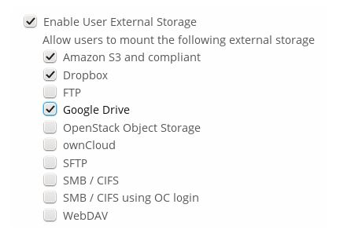
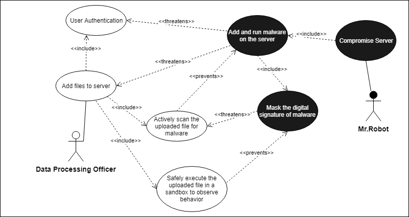

# Requirements for Software Security Engineering

## Backstory

Nextcloud offers self-hosted online file storage services. Files stored on Nextcloud server can be shared among multiple users with different levels of access permissions. Nextcloud is being used in banking and financial organizations to control business needs. It enables customers and bank employees collaborate by making their data available anywhere through efficient file sharing workflows while keeping customer intelligence in-house.

## Essential Data Flows: Use Cases & Misuse Cases

### 1. View or Access Customer Profiles

### Use Case

When an existing customer visits bank, Bank Teller needs to access the customer profile. In order to view profile, bank teller needs to login. The first task is to enter the address of the Nextcloud server to connect. Then, he needs to enter the login id and the password. 

### Misuse Case

Rogue Teller wants to gain unauthorized access to the server to steal sensitive customer information. He could use, brute-force attack, session hijacking, dictionary attack to gain access to the server. 

### Security Requirements

This attacks can be prevented by implementing progressive delays, invalidating session after logout and by enforcing strong password requirements. However, strong passwords are still vulnerable to keylogger attacks. To prevent this, multi-factor authentication can be used.

### UML Diagram

### 2. Create and Share Links

### Use Case

Bank Teller receives an information request regarding the details of rate of interest on personal loan from a client. In this case, the bank teller creates and shares the link of file which contains detailed information on rate of interest. The client can then use the link to view the information from anywhere.  

### Misuse Case

Rogue Client who is hired by rival bank, wants to gain unauthorized access to steal confidential information related to bank’s credit policy stored on the server. He tries to modify links to gain access to the other confidential information.  

### Security Requirements

Unauthorized access via shared links can be prevented by encrypting links and protecting traffic with Transport Layer Security. 

### UML Diagram

### 3. Access data from third-party clients

### Use Case

Consider the scenario, where the bank teller requests client to provide proof of property documents in order to sanction loan. Client can then request bank teller that he is away from home and he can share copy of proof of documents stored in his dropbox. Bank Teller can use Nextcloud’s Mount External Storage feature. This feature provides a checkbox which when enabled allows clients in bank’s server share their external storage. Bank Teller can enable this feature and let client know that he can share the required documents through dropbox. Client can then share his document folder in dropbox directly through Nextcloud. 

### Misuse case

Rogue Client wants to compromise data on the bank’s server. He can deliberately request bank teller that he wants to share his documents through third party applications. When he gets the permission to share his external storage files, he can create deceptive identity by spoofing internet address. He can spoof internet address by faking the header information on Internet packets to make it look like it came from dropbox. Once he gains access, he can then use this as launching point for further unauthorized access.

### Security Requirements

To prevent this, DDP tools can be used and background configuration checks must also be done.

### UML Diagram

### 4. Send Customer Log Records

### Use case

Consider a joint account with multiple owners. A client who is an owner of the joint account can request bank employee for log of all owners activity for the last 6 month period. Bank employee can share the activity log of the account to the client. Client can then view all logs related to transaction summary. 

### Misuse case

Rogue teller wants to expose or overwrite sensitive information. He wants to tamper the log records to hide the illegal activity of the co-owner of join account whom he colluded with.

### Security Requirements

Security Requirements
To prevent log tampering, certain immutable attributes can be included which can track every change in the log files.

### UML Diagram

### 5. Add files to server

### Use case

A data processing officer connects to the Nextcloud server hosting all the banking information of its customers so as to add new data onto the server.

### Misuse case

A rogue data processing officer called Mr.Robot, connects to the Nextcloud server and uploads malware with an intention to execute it so as to compromise the bank’s nextcloud server.

### Security Requirements

To prevent rogue files from being added, the nextcloud server system must be equipped with the ability to detect malware beforehand.

### UML Diagram

## Alignment of security requirements with advertised features

### 1. View or Access Customer Profiles

- Next cloud provides two-factor authentication.
- Next cloud does not offer any progressive delays during login this may be vulnerable to a brute force attack by the hacker.
- Next cloud offers a strong password policy by checking the password against the list of breached passwords from haveibeenpwnd.com. This check creates a hash of the password and sends the first five characters of this hash to the haveibeenpwnd.com API to retrieve a list of all hashes that start with them. Then it checks on the Nextcloud instance if the password hash is in the result set.

### 2. Create and Share Links

- The file sharing section through links provides Admin(bank employee) features to manage cloud shares. He can enforce password protection and also set default expiration date on link shares.

- Nextcloud also provides features to enabling SSL to encrypt all traffic between servers.

- Nextcloud prevents data transfers on insecure networks like public WiFi networks, mobile devices or third party networks to protect from being intercepted.

### 3. Access data from third-party clients

- Nextcloud does not provide tools for Distributed Data Protection. 

- However, it recommends configuring the background job Webcron, to enable Nextcloud to automatically detect files added to your external storages.

### 4. Send Customer Log Records

- Nextcloud activity app recommends running background jobs to detect unusual activity in the logs. 

- It does not provide special attributes in the log file. But instead provides a console command, which allows to set up cron jobs on server with the known granularity. This sends the activity emails out whenever illegal activity is detected.

### 5. Add files to server

- Nextcloud server doesn't have the capability to scan for the uploaded file(s) so as to check if it is a malware 

- It only supports authentication and authorization from valid trusted servers and external storage mounts for sharing and adding of new data.

## Security-related configuration and installation issues.

### Security related configuration

Following are few observations on security related configuration issues.

### Limit on password length

For security and performance reasons, Nextcloud uses bcrypt algorithm, it only verifies first 72 characters of passwords. This prevents Denial of Service attacks with long passwords. This applies to all passwords including user passwords, passwords on link shares, and passwords on external shares.

### Operating System

Nextcloud uses RFC 4086 mixer to generate cryptographically secure pseudo-random numbers. The random number generation also tries to request random numbers from /dev/urandom, thus it is highly recommended to configure setup in such a way that PHP is able to read random data from operating system.

### Use HTTPS

Using Nextcloud without using an encrypted HTTPS connection opens up server to a man-in-the-middle attack, and risks the interception of user data and passwords. It is a best practice, and highly recommended, to always use HTTPS on production servers, and to never allow unencrypted HTTP.

### Enable HTTP Strict Transport Security
Administrators are encouraged to set the HTTP Strict Transport Security header, which instructs browsers to not allow any connection to the Nextcloud instance using HTTP, and it attempts to prevent site visitors from bypassing invalid certificate warnings.

This can be setup within Apache VirtualHost file.

### Proper SSL configuration
Default SSL configurations by Web servers are often not state-of-the-art, and require fine-tuning for an optimal performance and security experience. They recommend using Mozilla SSL Configuration Generator to generate a suitable configuration suited for the system environment. HTTP compression is also disabled to mitigate the BREACH attack.

### Installation Issues

- Nextcloud default installation doesn't include usage of HTTPS to encrypt server's incoming and outgoing traffic and to protect users data in transit. 
- The administrator of the nextcloud must manually enforce HTTPS usage by installing new X.509 certificate from Let's Encrypt, a certificate issuing authority.
- A list of other Trusted Nextcloud servers can be added to the existing Netcloud server manually by using an in built app called 'Federation sharing', where the administrator requires 'username' and 'URL' of the user(s) on the remote Nextcloud server(s).
- External Storage mounts are disabled by default. If they were to enabled, administrator must choose appropirate authentication mechanism
- All the users can only access the Nextcloud server when the administrator has added them onto the server and shared the initial credentials
- There are no permission groups specified by default. Must be created and allocated as required.

## Additional Security-Related Observations

- While sharing public links to files, users have the ability to use the public link instead of actually logging in into the application. A workaround provided for this is to deny access to all users that are not member of a group.

- There is a possibility that users who have direct access to the external storage, can later change files there directly. Therefore it is recommended to disable the Allow users to mount external storage option, when trying to to completely lock out flagged users.

## Project Board

[Trello Project Board](https://trello.com/b/gPTAEzv4/sa-nextcloud)

